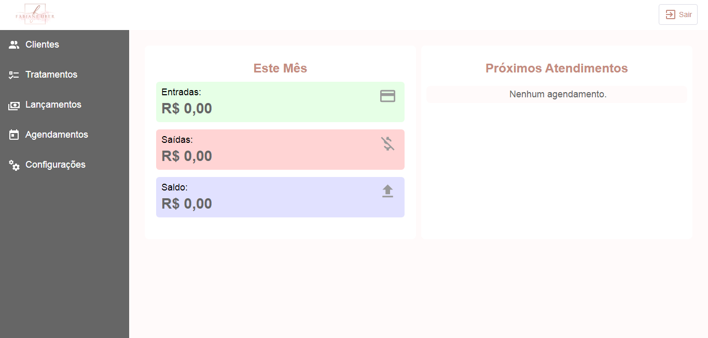
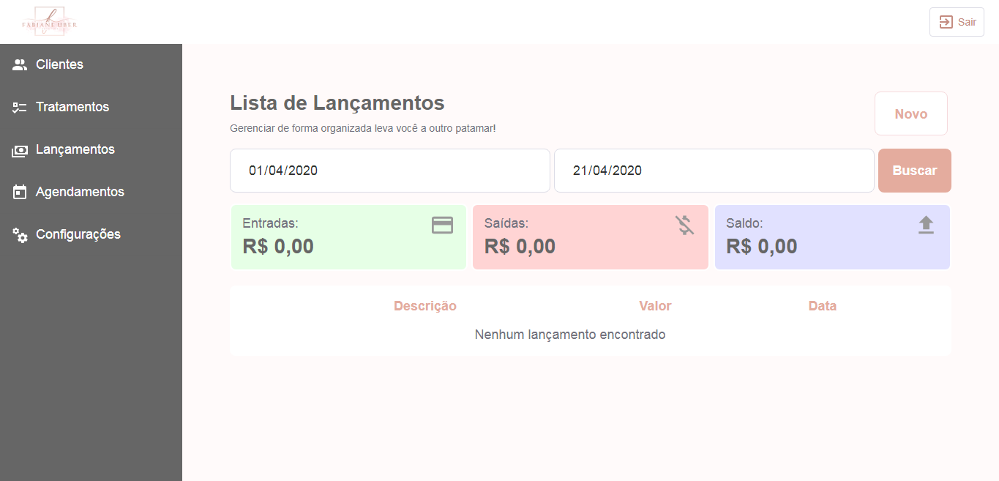
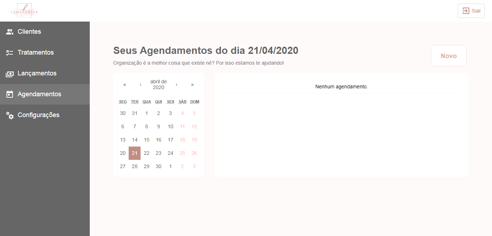

# Sistema de Gerenciamento de Fluxo de Caixa

Desenvolvimento da aplicação com os conceitos obtidos na <strong>Semana Omnistack da RocketSeatc</strong> utilizando NodeJS e ReactJS.

<h3>Objetivo do projeto</h3>
Realizar o gerenciamento do fluxo de caixa da estética e controlar todos os agendamentos realizados.

Foram desenvolvidas as seguintes telas:
<ul>
  <li>Login do usuário</li>
  <li>Página principal com resumo do mês e próximos 5 agendamentos</li>
  <li>Clientes: listagem, cadastro e edição</li>
  <li>Tratamentos: listagem, cadastro e edição</li>
  <li>Configurações do usuário: alteração de senha, email e nome</li>
  <li>Agendamentos: listagem por dia, cadastro, edição, exclusão e finalização convertendo em um lançamento</li>
  <li>Lançamentos: listagem por período com totais, cadastro e edição</li>
</ul>

<h3>Confira algumas telas do projeto:</h3>

Login

 

Página inicial

 

Lançamentos

 

Agendamentos

 
